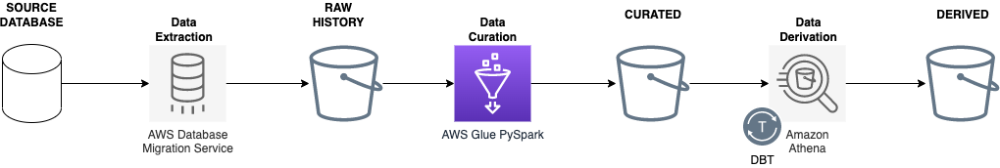
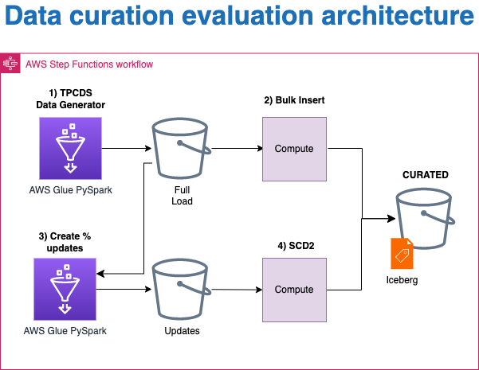
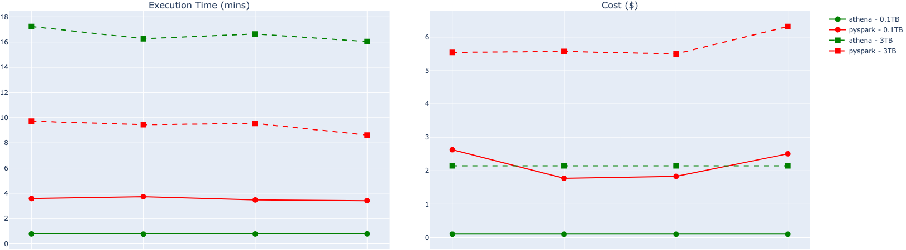
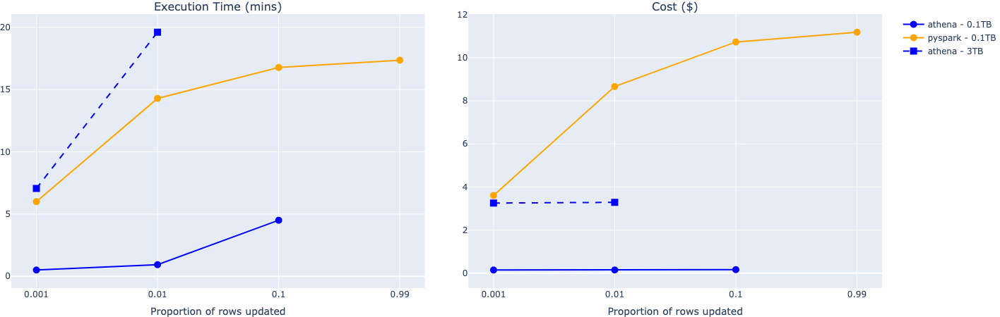

# Evaluation
[MoJ Analytical Platform](https://user-guidance.analytical-platform.service.justice.gov.uk/#content)

<style scoped>
section {
  text-align: center;
    justify-content: center;
}
</style>
---
## Contents

1. [Summary](#1-summary)
2. [Technical Concepts](#2-technical-concepts)
3. [Evaluation Methodology](#3-evaluation-methodology)
4. [Next Steps](#4-next-steps)
5. [Appendix](#5-appendix)

---
# 1) Summary

<style scoped>
section {
  text-align: center;
  justify-content: center;
}
</style>
---
## Data Pipeline Architecture As-Is

1. [AWS DMS](https://aws.amazon.com/dms/) for extracting full loads and changed data (cdc)

2. [AWS Glue PySpark](https://docs.aws.amazon.com/glue/latest/dg/spark_and_pyspark.html) for creating curated tables and orchestrated using [Step Functions](https://aws.amazon.com/step-functions/)
3. [Amazon Athena](https://www.amazonaws.cn/en/athena/) for creating derived tables and orchestrated using [dbt](https://www.getdbt.com/)
4. Data stored in [S3](https://aws.amazon.com/s3/) and metadata in [Glue Data Catalog](https://towardsaws.com/data-cataloging-in-aws-glue-c649fa5be715)



---
## Data Pipeline Architecture To-Be

Option 1: Convert curated tables to [Iceberg](https://iceberg.apache.org/) table format


Option 2: Migrate curation to [Athena](https://www.amazonaws.cn/en/athena/) + [dbt](https://www.getdbt.com/) in conjunction with Iceberg


---
## Outcome

1. Out-of-the-box, Athena + Iceberg is **cheaper** and more **performant** for our use cases than Glue PySpark + Iceberg
2. Iceberg is compatible with the data engineering tool set which facilitates **adoption**
3. Iceberg **simplifies** the code which makes it easier to maintain

##### Hence we are proceeding with option 2

This also unifies the data engineering tech stack which facilitates **collaboration** and minimizes duplication

---
## Lessons learnt

Re-evaluate objectives regularly!

The investigation was initially supposed to compare Glue PySpark against Hudi and Iceberg table formats.

We quickly expanded the investigation to include Athena, but wasted time investigating Hudi further  when it was clear Iceberg was the clear winner for our use cases.

---
# 2) Technical Concepts

<style scoped>
section {
  text-align: center;
    justify-content: center;
}
</style>
---
## Data curation processes

1. Bulk insert full loads
3. Remove duplicate data
3. Apply [Type 2 Slowly Changing Dimension (SCD2)](https://en.wikipedia.org/wiki/Slowly_changing_dimension) to track row changes over time:

| id | status | updated_at | valid_from | valid_to | is_current |
| -- | ------ | ---------- | ---------- | ------------ |-|
| 1 | pending | 2019-01-01 | 2019-01-01 | 2019-01-02 | False|
| 1 | shipped | 2019-01-02 | 2019-01-02 | `null` | True |

SCD2 is difficult because:

- Deltas can contain multiple and/or late-arriving updates
- Requires updating historic records

---
## Issues with [Glue PySpark job](https://github.com/ministryofjustice/analytical-platform-data-engineering/blob/main/glue_database/glue_jobs/create_derived_table.py)

1. Performance has degraded over the last few months, with monthly costs quadrupling
2. Uses complex process for handling [data shuffling](https://medium.com/distributed-computing-with-ray/executing-a-distributed-shuffle-without-a-mapreduce-system-d5856379426c) which makes it hard to maintain 
3. Large volumes of intermittent missing data and duplicates, but given the complexity of the current job, the root-cause could not be identified

Could we improve performance and simplify the PySpark job by making use of Iceberg?

<!-- 
Because of its size, a distributed dataset is usually stored in partitions, with each partition holding a group of rows. 
This also improves parallelism for operations like a map or filter. 
A shuffle is any operation over a dataset that requires redistributing data across its partitions. 
Examples include sorting and grouping by key. 
-->

---
## Data Lake [table formats]((https://www.dremio.com/blog/comparison-of-data-lake-table-formats-apache-iceberg-apache-hudi-and-delta-lake/))

- A way to organise a datasets' files to present them as a *table*
- [Apache Hive](https://hive.apache.org/) table format defines a table as all the files in one or more particular directories

- [Modern table format](https://www.dremio.com/blog/comparison-of-data-lake-table-formats-apache-iceberg-apache-hudi-and-delta-lake/) ([Apache Hudi](https://hudi.apache.org/), [Delta Lake](https://delta.io/), and Apache Iceberg) store additional metadata and table statistics
- This allows query engines to better identify relevant data files, minimising data scans and speeding up queries


<!--
Apache Hive is a distributed, fault-tolerant data warehouse system that enables analytics at a massive scale.
Hive transforms HiveQL queries into MapReduce jobs that run on Apache Hadoop. 
It queries data stored in a distributed storage solution, like the Hadoop Distributed File System (HDFS) or Amazon S3. 
Hive stores its database and table metadata in a metastore, 
which is a database or file backed store that enables easy data abstraction and discovery.

Advantages of Hive:
1. De-facto standard
2. Works with basically every engine
2. Can make use of partitions to speed up queries
3. File format agnostic
4. Can atomically update a partition

Problems with Hive:
1. Table scans unless you make efficient use of partitions

Metadata structures are used to define:
- What is the table?
- What is the table’s schema?
- How is the table partitioned?
- What data files make up the table?
-->


---
## ACID Transactions

- Hive does not easily support updates or deletes
- A common work-around is [Write-Audit-Publish (WAP)](https://lakefs.io/blog/data-engineering-patterns-write-audit-publish/) pattern:
  1. Rewrite sections or all of the data to a staging location
  2. Audit the new data
  3. Replace the exising data or point the data catalogue to the new location
- This causes huge data duplication and redundant ETL jobs

- Modern table formats ensures [ACID guarantees](https://www.dremio.com/blog/comparison-of-data-lake-table-formats-apache-iceberg-apache-hudi-and-delta-lake/) on inserts, deletes, and updates, with the option to run these operations concurrently

---
## Why Apache Iceberg?

Comparison of table formats:
1. [Performance]((https://www.onehouse.ai/blog/apache-hudi-vs-delta-lake-transparent-tpc-ds-lakehouse-performance-benchmarks)) is very dependent on optimisation
2. [Community support](https://www.onehouse.ai/blog/apache-hudi-vs-delta-lake-vs-apache-iceberg-lakehouse-feature-comparison) is comparable
3. [Ecosystem support](https://www.onehouse.ai/blog/apache-hudi-vs-delta-lake-vs-apache-iceberg-lakehouse-feature-comparison) is more varied:

|Ecosystem|Hudi|Delta Lake|Iceberg|
|-|-|-|-|
|AWS Glue PySpark|Read+Write+DDL|Read+Write+DDL|Read+Write+DDL|
|Amazon Athena|Read|Read|Read+Write+DDL|

Athena only has write and DDL support for Iceberg tables
=> **Iceberg makes Athena  a viable alternative to AWS Glue PySpark for ETL**

<!-- 
Data Definition Language [DDL](https://en.wikipedia.org/wiki/Data_definition_language) queries. 
In the context of SQL, data definition or data description language (DDL) is a syntax for creating and modifying database objects such as tables, indices, and users. 
DDL statements are similar to a computer programming language for defining data structures, especially database schemas. 
Common examples of DDL statements include CREATE, ALTER, and DROP. 
-->

---
## Why Amazon Athena?
 
- Athena runs queries in a distributed query engine using [Trino](https://trino.io/) under the hood
- Athena has many advantages over Glue PySpark:
  - Costs based on amount of data scanned ($5/TB)
  - Determines optimum cluster query settings dynamically
  - [Sacrifices](https://trino.io/docs/current/admin/fault-tolerant-execution.html) mid-query fault-tolerance for faster execution
  - Shallower learning curve
- Athena [V3](https://aws.amazon.com/blogs/big-data/upgrade-to-athena-engine-version-3-to-increase-query-performance-and-access-more-analytics-features/) better integrated with Data Catalog and Iceberg
- Athena has various [service quotas](https://docs.aws.amazon.com/athena/latest/ug/service-limits.html) but these can be increased 
- Athena in conjunction with dbt can be used for ETL
- dbt can manage concurrent workloads to minimise [throttling](https://docs.aws.amazon.com/athena/latest/ug/performance-tuning.html)

<!-- 
Trino can push down the processing of queries, or parts of queries, into the connected data source: https://trino.io/docs/current/optimizer/pushdown.html

Why dbt?
write custom business logic using SQL
automate data quality testing
deploy the code
publish documentation side-by-side with the code 
-->

---
# 3) Evaluation Methodology

<style scoped>
section {
  text-align: center;
    justify-content: center;
}
</style>
---
## Evaluation criteria

In order of importance :
1. Compatibility with existing tech stack and tool sets
2. Minimise running costs
3. Minimise code complexity / maximise readability
3. Minimise execution time


- Time is less important because use daily batch processes which run over night
- Time is still relevant because:
  - there is a direct relationship between time and cost for Glue PySpark
  - Athena has run time quotas

---
## TPC-DS Benchmark

[TPC-DS](https://www.tpc.org/tpcds/default5.asp) is a data warehousing benchmark consisting of: 
- [25 tables](https://github.com/BlueGranite/tpc-ds-dataset-generator) whose total size can vary (1GB to 100TB) 
- [99 SQL queries](https://github.com/awslabs/aws-athena-query-federation/tree/master/athena-tpcds/src/main/resources/queries) ranging from simple aggregations to advanced pattern analysis

AWS often uses TPC-DS for example to validate:
- Hudi speeds up [bulk inserts and upserts](https://aws.amazon.com/blogs/big-data/part-1-get-started-with-apache-hudi-using-aws-glue-by-implementing-key-design-concepts/) with Glue PySpark
- Athena V3 can [increase query performance](https://aws.amazon.com/blogs/big-data/upgrade-to-athena-engine-version-3-to-increase-query-performance-and-access-more-analytics-features/)

---
## Data curation evaluation architecture



The compute consists  of:
1. [Glue PySpark job with Spark SQL queries](https://github.com/moj-analytical-services/iceberg-evaluation/blob/add-write-up/src/data_curation/glue_jobs/pyspark_functions.py) 
2. [Glue Python shell job with Athena SQL queries](https://github.com/moj-analytical-services/iceberg-evaluation/blob/add-write-up/src/data_curation/glue_jobs/athena_functions.py)

To ensure fairness we used:
 - similar SQL statements
 - out-of-the-box configuration with no optimisations

---
## Data curation data generation

- Used [TPC-DS connector for AWS Glue](https://aws.amazon.com/marketplace/pp/prodview-xtty6azr4xgey) to generate the TPC-DS `stores_sales` table at scales: 
  - 0.1TB (~290 million rows, 21 GB)
  - 3TB (~8 billion rows, 440 GB)

- Used a PySpark job to simulate updates with increasing proportion of rows updated: 0.1, 1, 10, 99% 

- By comparison, our largest table `oasys_question`:

  - Contains ~3 billion rows, 460 GB
  - Receives upto ~2.5 million daily updates (0.08%)

---
## Bulk Insert comparison


- Athena (blue) is cheaper than PySpark (orange) at both scales
- PySpark is faster at larger scales (dashed square)

---
## MERGE and SCD2 logic

[MERGE](https://www.oreilly.com/library/view/sql-in-a/9780596155322/re31.html) (ANSI-SQL2003) combines UPDATE and INSERT:

```
MERGE INTO {object_name | subquery} [ [AS] alias ]
USING table_reference [ [AS] alias ]
ON search_condition
WHEN MATCHED
   THEN UPDATE SET column = { expression | DEFAULT }[, ...]
 WHEN NOT MATCHED
   THEN INSERT [( column[, ...] )] VALUES ( expression[, ...] )
```

- Iceberg supports [MERGE INTO](https://iceberg.apache.org/docs/latest/spark-writes/#merge-into) by rewriting data files that contain rows that need to be updated

- This improves performance and simplifies the code

---
## SCD2 comparison - 100 GB


- Athena is consistently cheaper and faster than PySpark, by a massive margin
- However, Athena fails at the highest update proportions

---
## SCD2 comparison - 3 TB


- PySpark fails at all update proportions
- Athena passes at the lower update proportions, as per our use cases

---
## Data derivation evaluation

We used the TPC-DS queries as a subsitute for data derivation processes

**Stats for TPC-DS queries against Iceberg tables relative to Hive:**
| Scale  | Partitioned| File Size| Execution Time |Data Scanned |
|-|-|-|-|-|
|[1GB](https://github.com/moj-analytical-services/iceberg-evaluation/blob/main/src/data_derivation/query_performance/benchmark.ipynb)|No| 0.7x|2.7x| 1.5x|
|[3TB](https://github.com/moj-analytical-services/iceberg-evaluation/blob/main/src/data_derivation/query_performance/benchmark_3000.ipynb) |Yes|0.03x|1.2x | 0.9x|

Note that the 3TB Hive dataset was optimised, unlike for the Iceberg dataset, and we still obtained comparable performance.

<!-- The relative execution time and data scanned varies depending on the scale and partitioning, but within an acceptable range. -->

---
## Compatibility with AP Tools set

Data engineering have built various [tools](https://user-guidance.analytical-platform.service.justice.gov.uk/tools/index.html#tools) to support data analysis on the MoJ Analytical Platform. 

We verified these tools were compatible with Iceberg including:
- [database-access](https://github.com/moj-analytical-services/data-engineering-database-access) which grants database access to AP users

- [pydbtools](https://github.com/moj-analytical-services/pydbtools)  for querying databases using Python and Athena
- [Rdbtools](https://dyfanjones.github.io/noctua/reference/index.html) for querying databases using R and Athena
- [create-a-derived-table](https://github.com/moj-analytical-services/create-a-derived-table) customises [dbt-athena](https://github.com/dbt-athena/dbt-athena) to build data pipelines on the AP

---
## Considerations and Limitations

Athena support for Iceberg tables has various [limitations](https://docs.aws.amazon.com/athena/latest/ug/querying-iceberg.html).

We came across the following limitations during the evaluation:

- Athena supports only millisecond precision for timestamps so timestamp columns need to be cast as TIMESTAMP(6) 
- Athena has a 100 partitions limit with INSERT INTO, which applies to Iceberg tables as well. See [here](https://docs.aws.amazon.com/athena/latest/ug/ctas-insert-into.html) for a work-around
- Iceberg metadata is not fully integrated with the Glue Data Catalogue for example:
  - dropped column still appear
  - partitioned columns are not flagged as partitioned

---
# 4) Next Steps

<style scoped>
section {
  text-align: center;
  justify-content: center;
}
</style>
---
## Risks

- No time to investigate the impact of:
  - data skew on write-performance
  - table width on write-performance
  - simultaneously updating and querying a table on read-performance

- Replacing dependency on specialist Spark expertise with specialist Athena and Iceberg expertise
- Athena might not be able to handle future volumes

---
## Knowns Unknowns

1. When is Glue PySpark preferred over Athena?
2. How to best improve Athena [query performance](https://docs.aws.amazon.com/athena/latest/ug/performance-tuning.html) using sorting, partitions, file compaction etc...
2. What is the maximum volume capacity with these optimisations in place?
2. How to best scale up for full refreshes in a disaster recovery scenario
2. How to best integrate with dbt and [create-a-derived-table](https://github.com/moj-analytical-services/create-a-derived-table)
3. How to best monitor code complexity and flag violations
4. How to best publish Iceberg metadata not available in the Data Catalogue

---
# 5) Appendix

<style scoped>
section {
  text-align: center;
  justify-content: center;
}
</style>
---
## Contributors

David Bridgwood
Chris Foufoulides
Gwion Aprhobat
Khristiania Raihan
Soumaya Mauthoor
Theodore Manassis
William Orr

## Acknowledgements

Alex Vilela, Anis Khan, Calum Barnett

---
## Codebase

For  the code and interim results please refer to the [iceberg-evalution](https://github.com/moj-analytical-services/iceberg-evaluation) GitHub repo

---
## If we had had more time...

- Run Bulk Insert and SCD2 with Glue PySpark and Athena against Hive tables to estimate performance gains against Iceberg

- Run the TPC-DS queries in Spark SQL to compare performance against Athena
- Terraform the codebase to allow collaborators to more easily reproduce the results
- Investigate SCD2 failures to identify origin and improve understanding of Glue PySpark vs Athena

---
## Iceberg Metadata


Apache Iceberg’s approach is to define the table through three categories of metadata. These categories are:

- “metadata files” that define the table
- “manifest lists” that define a snapshot of the table
- “manifests” that define groups of data files that may be part of one or more snapshots

[source](https://www.dremio.com/blog/comparison-of-data-lake-table-formats-apache-iceberg-apache-hudi-and-delta-lake/)

---
## Athena Resource limits

When you submit a query, the Athena engine query planner estimates the compute capacity required to run the query and prepares a cluster of compute nodes accordingly. 

Some queries like DDL queries run on only one node. Complex queries over large data sets run on much bigger clusters. The nodes are uniform, with the same memory, CPU, and disk configurations. Athena scales out, not up, to process more demanding queries.

Sometimes the demands of a query exceed the resources available to the cluster running the query. The resource most commonly exhausted is memory, but in rare cases it can also be disk space. 

[source](https://docs.aws.amazon.com/athena/latest/ug/performance-tuning.html)

<style>
section {
  text-align: left;
  justify-content: flex-start;
}
a, h1, h2, h5 {
  color: #1d70b8;
}
a {
  text-decoration: underline;
}
img {
  display: block;
  margin-left: auto;
  margin-right: auto;
}
table {
  margin-left: auto;
  margin-right: auto;
}
</style>