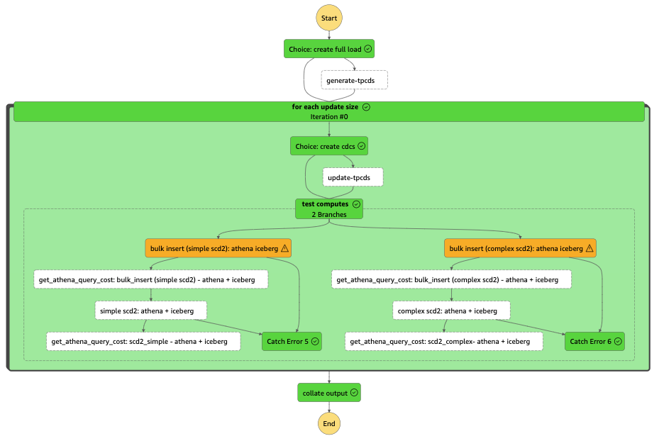
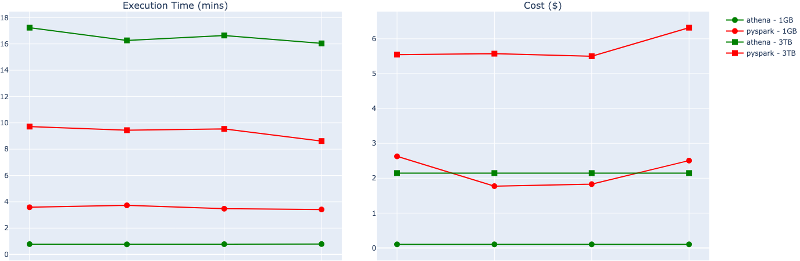
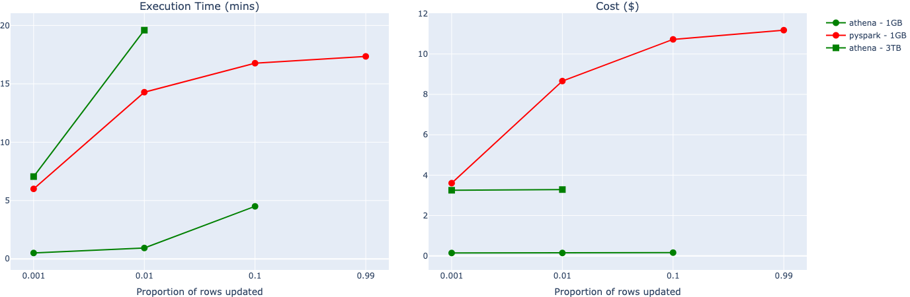

**--DRAFT--**

# Evaluation
---
## Synopsis

---

## Overview

1. Why did we decide to investigate [Apache Iceberg](https://iceberg.apache.org/)?
2. How did we evaluate [Apache Iceberg](https://iceberg.apache.org/) for our use cases?
4. Conclusions, risks and roadmap

---

# Why did we investigate [Apache Iceberg](https://iceberg.apache.org/)?

---
## Existing Data Pipeline

Change Colors!!
1. [AWS DMS](https://aws.amazon.com/dms/) to extract full loads and changed data (cdc)
2. [AWS Glue PySpark](https://docs.aws.amazon.com/glue/latest/dg/spark_and_pyspark.html) to create curated tables 
3. [Amazon Athena](https://www.amazonaws.cn/en/athena/) + [DBT](https://www.getdbt.com/) to create derived tables
4. Data stored in [S3](https://aws.amazon.com/s3/) and metadata in [Glue Data Catalog](https://towardsaws.com/data-cataloging-in-aws-glue-c649fa5be715)

See [Managed Pipelines](https://ministryofjustice.github.io/analytical-platform-data-engineering/) for more details

---
## Data Curation processes

1. Bulk insert full loads
2. Impute any deleted rows prior to additional full loads
3. Remove duplicate data
3. Apply [Type 2 Slowly Changing Dimension (SCD2)](https://en.wikipedia.org/wiki/Slowly_changing_dimension) to track how a row changes over time: 

| id | status | updated_at | valid_from | valid_to |
| -- | ------ | ---------- | ---------- | ------------ |
| 1 | pending | 2019-01-01 | 2019-01-01 | 2019-01-02 |
| 1 | shipped | 2019-01-02 | 2019-01-02 | `null` |

---
## Issues with [Glue PySpark job](https://github.com/ministryofjustice/analytical-platform-data-engineering/blob/main/glue_database/glue_jobs/create_derived_table.py)

1. Performance has degraded over the last few months, with monthly costs quadrupling
1. Highly nested function structure
2. Very complex process for handling [data shuffling](https://medium.com/distributed-computing-with-ray/executing-a-distributed-shuffle-without-a-mapreduce-system-d5856379426c) which makes it hard to maintain/debug 
3. Large volumes of intermittent missing data and duplicates, but given the complexity of the current job, the root-cause could not be identified
4. Lack of specialist Spark expertise in the team

---
## Data Lake Table Formats

- [Table formats](https://www.dremio.com/blog/comparison-of-data-lake-table-formats-apache-iceberg-apache-hudi-and-delta-lake/) abstract groups of data files as a single "table" so we can treat data lakes like databases
- [Apache Hive](https://hive.apache.org/), the original table format, defines a table as all the files in one or more particular directories
- [Modern table format](https://www.dremio.com/blog/comparison-of-data-lake-table-formats-apache-iceberg-apache-hudi-and-delta-lake/) ([Apache Hudi](https://hudi.apache.org/), Databrick's [Delta Lake](https://delta.io/), and Apache Iceberg) store additional metadata 
- Allows query engines to identify relevant data files -> minimise data scans and speed up queries

---
## Acid Transactions

Row level changes!

-
-
-

---
## Why Apache Iceberg?

1. Performance is very dependent on [optimisation](https://www.onehouse.ai/blog/apache-hudi-vs-delta-lake-transparent-tpc-ds-lakehouse-performance-benchmarks)
2. Community support between the 3 options is comparable
2. [Ecosystem support](https://www.onehouse.ai/blog/apache-hudi-vs-delta-lake-vs-apache-iceberg-lakehouse-feature-comparison):

|Ecosystem|Hudi|Delta Lake|Iceberg|
|-|-|-|-|
|AWS Glue|Read+Write|Read+Write|Read+Write|
|Athena|Read|Read|Read+Write|

---
## Why Amazon Athena?

With Iceberg, it's now possible to use Athena to process jobs previously not possible. This has many advantages:

1. Costs based on amount of data scanned ($5/TB)
2. Let Amazon Athena determine optimum server?? settings
3. Unified tech stack across data pipeline

---
## Glue vs Athena

-
-
-

---
## Questions to Answer

1. Can we leverage Apache Iceberg?
2. Can we replace Glue PySpark with Amazon Athena?
3. What is the impact  on Data Derivation processes?

---
# How did we evaluate [Apache Iceberg](https://iceberg.apache.org/) for our use cases?

---
## Evaluation Criteria

-
-
-

---
## TPCDS Benchmarking

-
-
-

---
## 

## Data Curation Use Cases

1. Full load Bulk Insert and addition of reference columns

2. "Simple" SCD2 where there is only one update per PK which is more recent than the current record

3. "Complex" SCD2 where there can be multiple updates per PK as well as [late-arriving records]()

---
## Components

- PySpark + Iceberg glue job
- Python Shell +

---
## Step Function (demonstrative)

---
## Results - Bulk Insert

- Athena is cheaper than PySpark at both scales
- PySpark is faster at larger scales

---
## Results - SCD2

- Athena is consistently cheaper and faster than PySpark
- PySpark job at 3TB scale failed at all proportions
- Athena query failed at higher proportions

---
## Code complexity

Used radon to calculates measures of code complexity:
- Logical Lines Of Code (LLOC)
- Cyclomatic Complexity (CC)
- Maintainability Index (MI)
We compared Athena + Iceberg and Glue PySpark + Iceberg and found theres little difference between the options

---
## Data Curation conclusions

- Athena+Iceberg can handle cdc volumes of 80 million rows against a table of 8 billion rows
- Our current largest table is ~3 billion rows with daily cdcs of ~1 million
- All done with 0 optimisation, there are many optimisations we could make to further handle larger volumes (e.g. sorting, partitioning, etc...)

---

## Data Derivation Use Cases
- 
-
-

---
## Results

-
-
-

---
# Conclusion, Risks and Roadmap

---
## Conclusions

-
-
-

---
## Risks

- Did not have time to investigate:
  - impact of data skew on write-performance
  - impact of table-width on write-performance
  - updating a table impact read-performance
- Replacing dependency on specialist spark expertise with Iceberg expertise
- The proposed solution might not be able to handle future volumes

---
## Questions to Answer

1. How to improve performance using sorting, partitions, file compaction etc...
2. Estimate maximum volume capacity with these optimisations in place
2. How to leverage DBT and [create-a-derived-table](https://github.com/moj-analytical-services/create-a-derived-table)
3. How to monitor code complexity with create-a-derived-table and flag violations

---
## Roadmap

-
-
-

---
# Appendix

---
## Modern glue development options

These modern [glue development options](https://docs.aws.amazon.com/glue/latest/dg/aws-glue-programming-etl-libraries.html) helped us to develop and test glue pyspark jobs:

-
-

