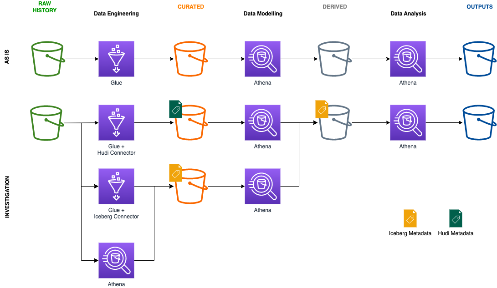

# Hudi vs Iceberg

## Context

[Managed Pipelines](https://ministryofjustice.github.io/analytical-platform-data-engineering/) pulls full loads and on-going data changes from various MOJ legacy/heritage databases to the [Analytical Platform](https://user-guidance.services.alpha.mojanalytics.xyz/), MoJ's data analysis environment, providing modern tools and key datasets for MoJ analysts.

Managed Pipelines uses an AWS Glue PySpark job to curate the data through a daily batch process:

- CDC changes - Implement a [Type 2 Slowly Changing Dimension (SCD2)](https://en.wikipedia.org/wiki/Slowly_changing_dimension) to retain the full history of data. When a row is updated or deleted on the source database, the current record on the AP is "closed" and a new record is inserted with the changed data values.
- Full load changes - Impute records which where deleted since the last full or CDC load to ensure deletions are accurately recorded

The performance of the AWS Glue PySpark job has been degrading over the last few months, with monthly costs tripling. In addition, issues including large-volumes of missing-data and unexpected duplicates being introduced have occured, but given the complexity of the current job the root-cause could not be identified. We would like to improve the Managed Pipeline curation step to make use of recent advancements, reducing the complexity and creating a more efficient and maintainable solution.

The Apache Hudi and Iceberg frameworks for data lakes can simplify and enhance incremental data processing (Note that Delta Lake by Databricks is also available but more compatible with the Databricks environment and hence disreguarded). AWS has also recently released [Athena version 3.0](https://aws.amazon.com/about-aws/whats-new/2022/10/amazon-athena-announces-upgraded-query-engine/) with performance improvements with additional [iceberg-related features](https://www.matano.dev/blog/2023/02/14/athena-v3-deep-dive). We may no longer need all the processing power of Spark, because we no longer need to read all the data to memory before being able to update.

This repository investigates the performance improvements and limitations of using different combinations of glue/athena with hudi/iceberg. Many articles already compare Hudi and Iceberg e.g. https://www.onehouse.ai/blog/apache-hudi-vs-delta-lake-vs-apache-iceberg-lakehouse-feature-comparison. However we wanted to compare according to use cases relevant to the MoJ Analytical Platform, and the impact on downstream Data Modelling and Data Analysis capabilities.

### Current file size
Some analysis was carried out to get an idea of the curent volume of data that we are processing. Total (full load and cdc) file count and file size was collected for the raw history folders of both databases.

## Use Cases

The tables below summarise the different uses cases and combinations of technologies they were compared against. For more details, please refer to the individual links. The use cases have been split up by data function to help organise the findings, however there is some overlap between them.

### Data Engineering

Data Engineering use cases focus on versioning, deduping and uploading the data to the Analytical Platform.

It's not possible to write to a Hudi table with Athena, hence its exclusion from the options below.

|Use Case|Glue+Hudi|Glue+Iceberg|Athena+Iceberg|Glue+Hive?|
|-|:-:|:-:|:-:|:-:|
|Bulk Insert|:warning:  Slow|:white_check_mark:  Completed twice faster|:warning:  Slow||
|SCD2||||
|Impute deletions||||
|Deduplication||||
|Schema evolution (on Write)||||

The following use cases are out of scope:

- Streaming _ The Analytical Platform does not use streaming data as yet which makes it difficult to come up with a use case
- Concurrency _ This is only important when there are frequent updates to the data, which is not currently the case with the Analytical Platform
- Partition evolution _ The curated data is partioned by curation date, if at all

### Data Modelling and Analysis

Data Modelling and Analysis uses cases focus on querying and transforming the data.

Whilst it is possible to use glue to transform data, it is overly complicated for the use cases below. Hence we only consider Athena.

|Use Case|Athena+Hudi|Athena+Iceberg|Athena+Hive|
|-|:-:|:-:|:-:|
|Select|:x:  Not Possible|:white_check_mark:  Possible||
|Aggregation||||
|Join||||
|Schema evolution (on Read)||||
|Partition evolution||||
|Select during SCD2||||
|Timestamps||||
|DML||||
|Compatibility with existing tools||||

### Benchmarking

We will be using TPC-DS data on all use cases and the TPC-DS queries on the Data Modelling use cases.

#### What is TPC-DS?

From [Delta vs Iceberg vs hudi](https://databeans-blogs.medium.com/delta-vs-iceberg-vs-hudi-reassessing-performance-cb8157005eb0):

[TPC-DS](https://www.tpc.org/tpcds/default5.asp) is a data warehousing benchmark defined by the Transaction Processing Performance Council ([TPC](https://www.tpc.org/default5.asp)). TPC is a non-profit organization founded by the database community in the late 1980s with the goal of developing benchmarks that may be used objectively to test database system performance by simulating real-world scenarios. “Decision support” is what the “DS” in TPC-DS stands for. The TPC-DS data consists of 25 tables which can vary in total size drom 1GB to 100TB. 
There are 99 queries in total, ranging from simple aggregations to advanced pattern analysis.

It has been used in several benchmarking exercises:

- [Dive deep into AWS Glue 4.0 for Apache Spark](https://aws.amazon.com/blogs/big-data/dive-deep-into-aws-glue-4-0-for-apache-spark/) shows that glue 4.0 is 2.7 times more performant than glue 3.0
- [Upgrade to Athena engine version 3](https://aws.amazon.com/blogs/big-data/upgrade-to-athena-engine-version-3-to-increase-query-performance-and-access-more-analytics-features/) shows that certain queries with Athena 3.0 can show upto 10 times performance compared with 2.0, and scanned byte reduced by 12 times with Iceberg

#### Data Generation

We will be using the [TPC-DS connector for AWS Glue](https://aws.amazon.com/marketplace/pp/prodview-xtty6azr4xgey) to generate the data.
Note that the connector is only compatible with Glue 3.0 for the moment. For more details please refer to [tpcds-custom-connector-for-glue3](https://github.com/aws-samples/aws-glue-samples/tree/master/GlueCustomConnectors/development/Spark/glue-3.0/tpcds-custom-connector-for-glue3.0#readme).

- Data Modelling use cases : 1GB
- Data Engineering uses cases: `store_sales` table at 3TB, which equates to ~8B rows

**Criteria:**
1. Compatibility _ The proposed changes must be compatible with the existing Analytical Platform tool sets, for example dbt which is the recommended tool for creating derived tables
2. Cost _ Glue/Spark is priced at $0.44 per data processing unit (DPU) per hour. Athena is priced at $5.00 per TB of scanned data
3. Complexity / Readability _ How easy is it to understand what the code is doing? Can a problem be easily fixed?
4. Time _ Time it takes for job/query to complete

As these batch processes run over night, time is not as important as cost, although there is a direct relationship between time and cost for Glue/Spark. Complexity / Readability is quite subjective and can't be easily measured, we aim to identify a metric/metrics which can be used to compare the different solutions.

**Optimizations:**
- Partitioning / File compaction
- Multiple indexing
