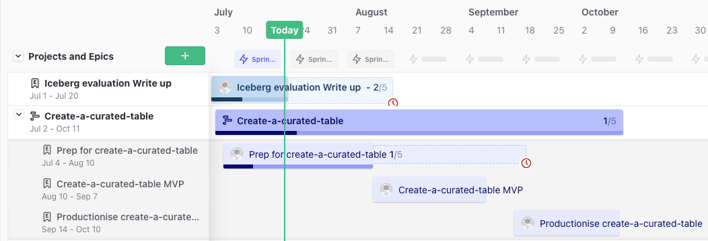

<style scoped>
section {
  text-align: center;
}
</style>

**--DRAFT--**


# Evaluation
[MoJ Analytical Platform](https://user-guidance.analytical-platform.service.justice.gov.uk/#content)

---
## Contents

1. [Summary](#1-summary)
2. [Technical Concepts](#2-technical-concepts)
3. [Evaluation Methodology](#3-evaluation-methodology)
4. [Next Steps](#4-next-steps)
5. [Appendix](#5-appendix)

---
<style scoped>
section {
  text-align: center;
}
</style>
# 1) Summary

---
## Data Pipeline Architecture As-Is

As summarised in [Managed Pipelines](https://ministryofjustice.github.io/analytical-platform-data-engineering/):
1. [AWS DMS](https://aws.amazon.com/dms/) for extracting full loads and changed data (cdc)
2. [AWS Glue PySpark](https://docs.aws.amazon.com/glue/latest/dg/spark_and_pyspark.html) for creating curated tables and orchestrated using [Step Functions](https://aws.amazon.com/step-functions/)
3. [Amazon Athena](https://www.amazonaws.cn/en/athena/) for creating derived tables and orchestrated using [DBT](https://www.getdbt.com/) via [create-a-derived-table](https://github.com/moj-analytical-services/create-a-derived-table)
4. Data stored in [S3](https://aws.amazon.com/s3/) and metadata in [Glue Data Catalog](https://towardsaws.com/data-cataloging-in-aws-glue-c649fa5be715)


---
## Data Pipeline Architecture To-Be

<sup>Option 1: Convert curated tables to [Iceberg](https://iceberg.apache.org/) table format<sup>


<sup>Option 2: Migrate curation to Athena + DBT in conjunction with Iceberg<sup> 


---
## Evaluation Outcome

1. Iceberg is compatible with the data engineering tool set
2. Out-of-the-box, Athena + Iceberg is cheaper and more performant for our use cases than Glue PySpark + Iceberg
3. Iceberg simplifies the curation logic so easier to maintain

**Hence we are proceeding with option 2**

This has the added advantage of unifying the data engineering tech stack which facilitates collaboration across the data engineering community of practice and minimizes duplication


---
<style scoped>
section {
  text-align: center;
}
</style>
# 2) Technical Concepts

---
## Data Curation

1. Bulk insert full loads
2. Impute any deleted rows prior to additional full loads
3. Remove duplicate data
3. Apply [Type 2 Slowly Changing Dimension (SCD2)](https://en.wikipedia.org/wiki/Slowly_changing_dimension) to track how a row changes over time: 

| id | status | updated_at | valid_from | valid_to |
| -- | ------ | ---------- | ---------- | ------------ |
| 1 | pending | 2019-01-01 | 2019-01-01 | 2019-01-02 |
| 1 | shipped | 2019-01-02 | 2019-01-02 | `null` |

---
## Issues with [Glue PySpark job](https://github.com/ministryofjustice/analytical-platform-data-engineering/blob/main/glue_database/glue_jobs/create_derived_table.py)

1. Performance has degraded over the last few months, with monthly costs quadrupling
2. Uses complex process for handling [data shuffling](https://medium.com/distributed-computing-with-ray/executing-a-distributed-shuffle-without-a-mapreduce-system-d5856379426c) which makes it hard to maintain and debug 
3. Large volumes of intermittent missing data and duplicates, but given the complexity of the current job, the root-cause could not be identified

Could we improve performance and simplify PySpark job by making use of Iceberg?

---
## Data Lake Table Formats

- [Table formats](https://www.dremio.com/blog/comparison-of-data-lake-table-formats-apache-iceberg-apache-hudi-and-delta-lake/) abstract groups of data files as a single "table" so we can treat data lakes like databases
- [Apache Hive](https://hive.apache.org/), the original table format, defines a table as all the files in one or more particular directories
- [Modern table format](https://www.dremio.com/blog/comparison-of-data-lake-table-formats-apache-iceberg-apache-hudi-and-delta-lake/) ([Apache Hudi](https://hudi.apache.org/), Databrick's [Delta Lake](https://delta.io/), and Apache Iceberg) store additional metadata 
- Allows query engines to identify relevant data files -> minimise data scans and speed up queries

---
## Acid Transactions

Row level changes!

-
-
-

---
## Why Apache Iceberg?

Comparison of table formats:
1. [Performance]((https://www.onehouse.ai/blog/apache-hudi-vs-delta-lake-transparent-tpc-ds-lakehouse-performance-benchmarks)) is very dependent on optimisation
2. [Community support](https://www.onehouse.ai/blog/apache-hudi-vs-delta-lake-vs-apache-iceberg-lakehouse-feature-comparison) is comparable
2. [Ecosystem support](https://www.onehouse.ai/blog/apache-hudi-vs-delta-lake-vs-apache-iceberg-lakehouse-feature-comparison) is more varied and Athena supports read, write, and DDL queries for [Apache Iceberg tables](https://docs.aws.amazon.com/athena/latest/ug/querying-iceberg.html) only:

|Ecosystem|Hudi|Delta Lake|Iceberg|
|-|-|-|-|
|AWS Glue|Read+Write|Read+Write|Read+Write|
|Athena|Read|Read|Read+Write|

---
## Why Amazon Athena?
 
- Athena is now more appealing because [V3](https://aws.amazon.com/blogs/big-data/upgrade-to-athena-engine-version-3-to-increase-query-performance-and-access-more-analytics-features/) has improved integration with the Glue Data Catalog and Iceberg
- Athena has many advantages over Glue PySpark:
  - Costs based on amount of data scanned ($5/TB)
  - Determines optimum cluster query settings dynamically
  - [Sacrifices](https://trino.io/docs/current/admin/fault-tolerant-execution.html) mid-query fault-tolerance for faster execution
  - More effective at [pushing down](https://trino.io/docs/current/optimizer/pushdown.html) operations to the data source which improves performance
- There is a 30min query [timeout](https://docs.aws.amazon.com/general/latest/gr/athena.html#amazon-athena-limits) but this is a soft limit
- DBT can manage parallel workloads to minimise [throttling](https://docs.aws.amazon.com/athena/latest/ug/performance-tuning.html)

---
<style scoped>
section {
  text-align: center;
}
</style>
# 3) Evaluation Methodology

---
## Evaluation Criteria

In order of importance :
1. Compatibility with existing tech stack and tool sets
2. Minimise running cost
3. Miniminse code complexity / maximise readability
3. Minimise Running Time

Time is less important than cost because our data pipelines consist of batch processes which run over night, although there is a direct relationship between time and cost for Glue PySpark.

---
## TPC-DS Benchmark

- [TPC-DS](https://www.tpc.org/tpcds/default5.asp) is an industry benchmark consisting of: 
  - 25 tables whose total size can vary (1GB to 100TB) 
  - 99 queries ranging from simple aggregations to advanced pattern analysis
- AWS used the TPC-DS 1TB `stores_sales` table to demonstrate how Hudi can speed up [bulk inserts and upserts](https://aws.amazon.com/blogs/big-data/part-1-get-started-with-apache-hudi-using-aws-glue-by-implementing-key-design-concepts/) 
- AWS used the TPC-DS queries against the 3TB scale data to show how Athena 3 can [increase query performance](https://aws.amazon.com/blogs/big-data/upgrade-to-athena-engine-version-3-to-increase-query-performance-and-access-more-analytics-features/)
- [TPC-DS connector for AWS Glue](https://aws.amazon.com/marketplace/pp/prodview-xtty6azr4xgey) generates TPC-DS datasets

---
<style scoped>
section {
   margin: 0em 0em 0em 0em;
   padding: 0px 10px 0px 0px;
}
p, ul, ol {
  font-size:30px;
}
</style>


The compute consists  of either:
1. [Glue PySpark job running SparkSQL queries](https://github.com/moj-analytical-services/iceberg-evaluation/blob/add-write-up/src/data_curation/glue_jobs/pyspark_functions.py) 
2. [Glue Python shell job running Athena queries](https://github.com/moj-analytical-services/iceberg-evaluation/blob/add-write-up/src/data_curation/glue_jobs/athena_functions.py) 

To ensure fairness we used:
 - similar SQL statements
 - out-of-the-box configuration with no optimisations


---
## Data Curation data generation

Generate TPC-DS `stores_sales` table at:
- Scales: 
  - 0.1TB (~290 million rows, 21.1 GB)
  - 3TB (~8 billion rows, 439.9 GB)
- Proportion of rows updated: 0.1, 1, 10, 99% 

By comparison, our largest table `oasys_question`:

- Contains ~3 billion rows, 460.3 GB
- Receives upto ~2.5 million daily updates (0.08%)

---
## Bulk Insert comparison


- Athena (green) is cheaper than PySpark (red) at both scales
- PySpark is faster at larger scales (dashed square)

---
## MERGE and SCD2 Logic

[MERGE](https://www.oreilly.com/library/view/sql-in-a/9780596155322/re31.html) (ANSI-SQL2003) combines UPDATE and INSERT:

```
MERGE INTO {object_name | subquery} [ [AS] alias ]
USING table_reference [ [AS] alias ]
ON search_condition
WHEN MATCHED
   THEN UPDATE SET column = { expression | DEFAULT }[, ...]
 WHEN NOT MATCHED
   THEN INSERT [( column[, ...] )] VALUES ( expression[, ...] )
```

[Iceberg](https://iceberg.apache.org/docs/latest/spark-writes/#merge-into) supports MERGE INTO by rewriting data files that contain rows that need to be updated. This improves performance and simplifies the logic.

---
## SCD2 comparison


- Athena is consistently cheaper and faster than PySpark
- PySpark job at 3TB scale failed at all update proportions
- Athena query failed at higher update proportions

---
## Deriving from Iceberg tables

-

---
## Compatibility with tool set

Data engineering have built various tools and libraries to support data analysis on the MoJ Analytical Platform:
- data-engineering-database-access:
- pydbtools
- Rdbtools

---
<style scoped>
section {
  text-align: center;
}
</style>
# 4) Next Steps

---
## Risks

- No time to investigate the impact of:
  - data skew on write-performance
  - table width on write-performance
  - simultaneously updating a table on read-performance
- Replacing dependency on specialist Spark expertise with specialist Athena and Iceberg expertise
- Athena might not be able to handle future volumes

---
## Knowns Unknowns

1. When is Glue PySpark preferred over Athena?
2. How to best improve Athena [query performance](https://docs.aws.amazon.com/athena/latest/ug/performance-tuning.html) using sorting, partitions, file compaction etc...
2. What is the maximum volume capacity with these optimisations in place?
2. How to best scale up for full refreshes in a disaster recovery scenario
2. How to best integrate with DBT and [create-a-derived-table](https://github.com/moj-analytical-services/create-a-derived-table)
3. How to best monitor code complexity and flag violations


---
## Roadmap



---

# 5) Appendix
---

## Repo Structure

All the code is available on the [GitHub Repository](https://github.com/moj-analytical-services/iceberg-evaluation)

---
## If we had had more time...

- Run Bulk Insert and SCD2 with glue PySpark and Athena against Hive to estimate performance gains against Iceberg
- Run the TPC-DS 99 queries in Spark SQL to compare performance against Athena
- Terraform codebase to allow collaborators to easily reproduce the results
- Investigate SCD2 failure causes to identify origin and improve understanding of Glue PySpark vs Athena

---
## Lessons learnt

Re-evaluate evaluation objectives regularly!

The investigation was initially supposed to compare Glue PySpark against Hudi and Iceberg. We quickly expanded the investigation to include Athena, but wasted time investigating Hudi further  when it was clear Iceberg was the clear winner


<style>
a,h1,h2 {
  color: #1d70b8;
}
a {
  text-decoration: underline;
}
p, ul, ol {
  font-size:35px;
}
ul, ol {
  margin-left: 0;
  margin-right: 0;
}
section {
  text-align: left;
}
img {
  display: block;
  margin-left: auto;
  margin-right: auto;
}
</style>