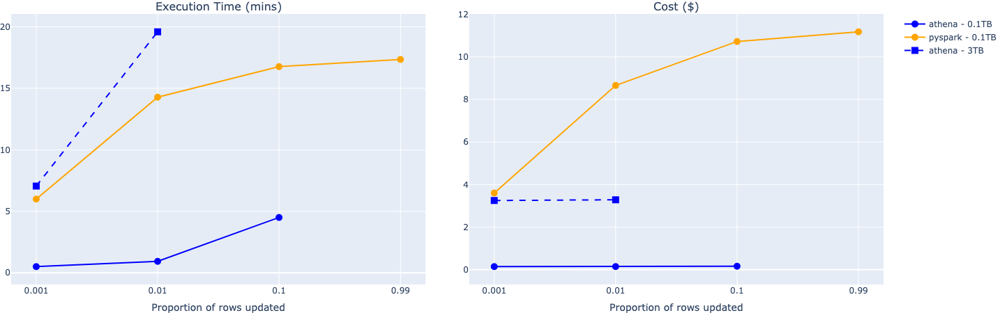

## x-gov Data Engineering ETL & Espresso

# Evaluating Iceberg and Athena for curation
\
[MoJ Analytical Platform](https://user-guidance.analytical-platform.service.justice.gov.uk/#content)
Codebase: [iceberg-evalution](https://github.com/moj-analytical-services/iceberg-evaluation)

---

- ## Context
- ## Challenges
- ## Options
- ## Evaluation
- ## Outcome
- ## Lessons Learnt
- ## Further Work

---

# Context

- Store data in AWS Data Lake
- Use AWS DMS to extract full and changed data
- Use AWS Glue to dedupe and version data (SCD2)
- Use AWS Athena to derive new tables 
- Tables can very in size from 10 - 3B rows (~100GB)

---

# Challenges

- Cost of AWS Glue job quadrupled!
- Performance of AWS Glue job degraded
- Large volumes of intermittent missing data and duplicates
- Glue job difficult to debug/maintain 

\

---

# Scope

## Things we needed

1. Compatible with existing tech stack
1. Cost effective
1. Reliable / Resilient curation architecture
1. Easy to implement and for new data engineers to pick up

## Things we liked

1. Compatible with other data pipelines

---

# Options - Table Format

Table formats provide a table-like abstraction on top of native file formats like Parquet by storing additional metadata.

Today, no single table format is the best fit for all use cases, and each format has its own unique strengths for specific requirements ([source](https://aws.amazon.com/blogs/big-data/choosing-an-open-table-format-for-your-transactional-data-lake-on-aws/))

Iceberg was the clear winner for our use case because of enhanced Athena support.

---

# Options - Compute

Option 1: Use Glue PySpark and [Iceberg](https://iceberg.apache.org/) orchestrated using Step Functions

Option 2: Use [Athena](https://www.amazonaws.cn/en/athena/) and [Iceberg](https://iceberg.apache.org/) orchestrated using [dbt](https://www.getdbt.com/)

---

# Evaluation

### Curate 0.1TB [TPCDS](https://www.tpc.org/tpcds/) stores_sales table (~0.3B rows, 21 GB)

---

# Evaluation

### Curate 3TB TPCDS stores_sales table (~8B rows, 440 GB)

Out-of-the-box, Athena + Iceberg is **cheaper** and more **performant** for our use cases than Glue PySpark + Iceberg

---

# Outcome

- We have already migrated 2 pipelines, and are in the process of migrating 2 more
- Achieved a cost reduction of 99%, and estimate cost savings of ~380K this year

---

# Lessons Learnt

### dbt vs Step Functions

Don't make any assumptions! The downstream pipelines were already using Athena and dbt for scheduling.

dbt is better suited for customised models, as opposed to running the same process against a large number of tables

### Scale-out vs scale-up

We evaluated the impact of scale-up i.e. what happens as the number of rows increases. We did not evaluate the impact of scale-out i.e. what happens as the number of tables increases.

---

# Further Work

- Support snapshots (in progress)
- Build incremental pipelines to speed up run-time
- Analyse and publish run and test metrics

